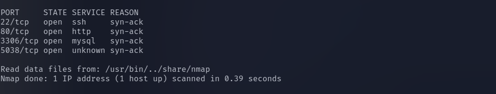

# Billing

## Scanning

Initial enumeration was performed using **Nmap**. The scan revealed the following open ports:

- **22** – SSH  
- **80** – HTTP  
- **3306** – MySQL  
- **5038** – Asterisk Call Manager  

Since a web service was available on port **80**, the next step was to investigate the website.



---

## Web Enumeration

After accessing the website, extensive manual enumeration was performed. No obvious vulnerabilities or sensitive information were discovered during the initial inspection.

However, the page title revealed that the application in use was **MagnusBilling**. This information provided a useful lead for further research.

After searching for known vulnerabilities affecting MagnusBilling, a relevant exploit was discovered:

**CVE-2023-30258 — Unauthenticated Remote Code Execution**

Reference:  
https://www.rapid7.com/db/modules/exploit/linux/http/magnusbilling_unauth_rce_cve_2023_30258/

This vulnerability allows an attacker to execute commands on the server without authentication.


---

## Initial Access

The vulnerability was exploited using the **Metasploit Framework**. After configuring the required module parameters, the exploit was executed successfully and a shell was obtained on the target machine.

Once inside the system, basic enumeration was performed. The **user flag** was located using the `find` command.


---

## Privilege Escalation

To identify potential privilege escalation vectors, the following command was executed:

```bash
sudo -l
```

This command lists all commands the current user is allowed to run with **sudo privileges**.

The output revealed that the user was allowed to run **fail2ban-client** as **root**.

---

## Understanding Fail2Ban

Fail2Ban is an intrusion prevention system that monitors log files for suspicious activities such as repeated authentication failures.

When multiple failed attempts are detected, Fail2Ban automatically bans the offending IP address by updating firewall rules.

---

## Exploiting Fail2Ban

Because **fail2ban-client** could be executed with sudo privileges, it became a viable path for privilege escalation.

The attack involved the following steps:

1. Creating a custom **Fail2Ban action configuration**  
2. Injecting a **malicious command** into the action configuration  
3. Triggering the action by banning an IP address  
4. Executing the payload with **root privileges**

The payload used:

```bash
chmod +s /bin/bash
```

This command sets the **SUID bit** on `/bin/bash`, allowing it to execute with **root privileges**.

After the action was triggered, a root shell was obtained using:

```bash
/bin/bash -p
```

This resulted in **privileged root access**, successfully completing the privilege escalation phase.
